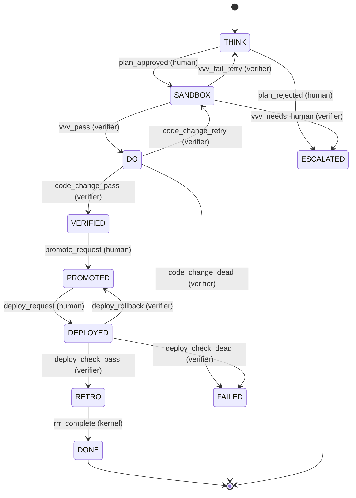

# Trinity Graph Specification v1.0

> **Graph = workflow skeleton (ไม่ใช่สมอง)**
>
> AI may propose transition. AI may NOT decide transition.
> Authority ∈ {verifier, policy, human, kernel}

---

## 0. Status

- **Phase:** 6
- **Depends on:** Phase 1 (Tool Contract), Phase 4 (Verifier), Phase 5 (Loop)
- **Critical fix from feedback:** Graph blueprint ไม่ได้ระบุใครเปลี่ยน state — ต้องมี `decided_by`

---

## 1. Why Two-Layer Graph

### Problem ของ graph ชั้นเดียว
- Mix runtime (RUNNING/IDLE) กับ workflow (THINK/DO/PROMOTED) → confused
- Workflow แตกต่างต่อ project — ใช้ graph เดียวไม่ได้

### Solution — 2 Layers

```text
Layer 1: Kernel Runtime Graph (stable, minimal)
  READY → SETUP → BUSY → VERIFYING → GATED → TERMINAL

Layer 2: Domain Workflow Graph (configurable, project-specific)
  THINK → SANDBOX → DO → VERIFIED → PROMOTED → DEPLOYED → RETRO → DONE
```

- **Layer 1** = process state (kernel-level lifecycle)
- **Layer 2** = business workflow (project-defined)
- ทั้งสองทำงานพร้อมกัน — Layer 1 manages process, Layer 2 tracks work

---

## 2. Layer 1: Kernel Runtime Graph

### 2.1 States (fixed)

```yaml
kernel_states:
  - name: READY
    terminal: false
    description: "Loop initialized, awaiting first goal"
  
  - name: SETUP
    terminal: false
    description: "Loading config, validating environment"
  
  - name: BUSY
    terminal: false
    description: "Executing tool / vendor AI / decomposition"
  
  - name: VERIFYING
    terminal: false
    description: "Calling verify-cli for verdict"
  
  - name: GATED
    terminal: false
    description: "Paused, waiting for human/policy/budget decision"
  
  - name: TERMINAL
    terminal: true
    description: "Done — successfully or otherwise"
```

### 2.2 Transitions (fixed)

```yaml
kernel_transitions:
  - { from: READY,     to: SETUP,     trigger: init_session,    decided_by: kernel }
  - { from: SETUP,     to: BUSY,      trigger: setup_complete,  decided_by: kernel }
  - { from: BUSY,      to: VERIFYING, trigger: action_complete, decided_by: kernel }
  - { from: VERIFYING, to: BUSY,      trigger: verdict_pass,    decided_by: verifier }
  - { from: VERIFYING, to: BUSY,      trigger: verdict_retry,   decided_by: verifier }
  - { from: VERIFYING, to: GATED,     trigger: verdict_human,   decided_by: verifier }
  - { from: VERIFYING, to: TERMINAL,  trigger: verdict_dead,    decided_by: verifier }
  - { from: GATED,     to: BUSY,      trigger: human_approve,   decided_by: human }
  - { from: GATED,     to: TERMINAL,  trigger: human_reject,    decided_by: human }
  - { from: BUSY,      to: TERMINAL,  trigger: budget_exhausted,decided_by: policy }
  - { from: ANY,       to: TERMINAL,  trigger: policy_violation,decided_by: policy }
```

### 2.3 Kernel Graph Properties

- **Stable** — เปลี่ยนน้อยมาก (versioned)
- **Minimal** — แค่ 6 states
- **No domain logic** — ไม่รู้เรื่อง THINK/DO/PROMOTED

---

## 3. Layer 2: Domain Workflow Graph

### 3.1 File Location

`.ai/graphs/<workflow-name>.yaml`

ตัวอย่าง:
- `.ai/graphs/standard.yaml` — generic workflow
- `.ai/graphs/deploy.yaml` — deployment-specific
- `.ai/graphs/seo.yaml` — SEO audit/fix workflow

### 3.2 Schema

```yaml
version: 1
name: standard
description: "Generic Trinity workflow (THINK → DO → DEPLOY → RETRO)"

# State definitions
states:
  - name: <STATE_NAME>
    terminal: <bool>
    description: "..."
    on_entry:
      side_effects: []          # commands to run when entering
      verifier_rule_set: null   # auto-run verifier?
    on_exit:
      checkpoint: <bool>        # auto-checkpoint on exit?

# Transition definitions
transitions:
  - id: <unique_id>             # for audit reference
    from: <STATE>
    to: <STATE>
    trigger: <event_name>
    decided_by: verifier | policy | human | kernel
    require_human_approval: <bool>
    conditions:                 # additional constraints
      - <condition>
    side_effects: []

initial_state: <STATE>
```

### 3.3 Example: `standard.yaml`

```yaml
version: 1
name: standard
description: "Trinity standard workflow — <upstream-project>-style"

states:
  - name: THINK
    terminal: false
    description: "Goal analysis + plan creation (vendor AI proposes)"
    on_exit: { checkpoint: true }
  
  - name: SANDBOX
    terminal: false
    description: "Multi-agent isolated work (gemini/claude/codex parallel)"
    on_entry:
      verifier_rule_set: pre_execute
  
  - name: DO
    terminal: false
    description: "Apply patches to dev/"
    on_exit:
      verifier_rule_set: code_change
      checkpoint: true
  
  - name: VERIFIED
    terminal: false
    description: "Code passed verification, awaiting promote"
  
  - name: PROMOTED
    terminal: false
    description: "Code in prod/, awaiting deploy"
    on_entry:
      side_effects: [snapshot_prod]
  
  - name: DEPLOYED
    terminal: false
    description: "Live in production"
    on_entry:
      verifier_rule_set: deploy_check
  
  - name: RETRO
    terminal: false
    description: "Retrospective writing"
    on_exit:
      side_effects: [memory_cli_index]
  
  - name: DONE
    terminal: true
    description: "Workflow complete"
  
  - name: FAILED
    terminal: true
    description: "Workflow failed"
    on_entry:
      side_effects: [archive_failure_artifacts]
  
  - name: ESCALATED
    terminal: true
    description: "Escalated to human, kernel exited"

initial_state: THINK

transitions:
  # ─── THINK → SANDBOX ───
  - id: t_001
    from: THINK
    to: SANDBOX
    trigger: plan_approved
    decided_by: human                     # ← human approves plan
    require_human_approval: true
  
  - id: t_002
    from: THINK
    to: ESCALATED
    trigger: plan_rejected
    decided_by: human
  
  # ─── SANDBOX → DO ───
  - id: t_003
    from: SANDBOX
    to: DO
    trigger: vvv_pass
    decided_by: verifier                  # ← verifier decides
    require_human_approval: false
  
  - id: t_004
    from: SANDBOX
    to: THINK                              # ← retry plan
    trigger: vvv_fail_retry
    decided_by: verifier
  
  - id: t_005
    from: SANDBOX
    to: ESCALATED
    trigger: vvv_needs_human
    decided_by: verifier
  
  # ─── DO → VERIFIED ───
  - id: t_006
    from: DO
    to: VERIFIED
    trigger: code_change_pass
    decided_by: verifier
  
  - id: t_007
    from: DO
    to: SANDBOX                            # ← retry
    trigger: code_change_retry
    decided_by: verifier
  
  - id: t_008
    from: DO
    to: FAILED
    trigger: code_change_dead
    decided_by: verifier
  
  # ─── VERIFIED → PROMOTED ───
  - id: t_009
    from: VERIFIED
    to: PROMOTED
    trigger: promote_request
    decided_by: human                     # ← human only!
    require_human_approval: true
    conditions:
      - has_consensus_md
      - tests_all_pass
  
  # ─── PROMOTED → DEPLOYED ───
  - id: t_010
    from: PROMOTED
    to: DEPLOYED
    trigger: deploy_request
    decided_by: human
    require_human_approval: true
  
  - id: t_011
    from: DEPLOYED
    to: PROMOTED                          # ← rollback
    trigger: deploy_rollback
    decided_by: verifier
  
  # ─── DEPLOYED → RETRO ───
  - id: t_012
    from: DEPLOYED
    to: RETRO
    trigger: deploy_check_pass
    decided_by: verifier
  
  - id: t_013
    from: DEPLOYED
    to: FAILED
    trigger: deploy_check_dead
    decided_by: verifier
  
  # ─── RETRO → DONE ───
  - id: t_014
    from: RETRO
    to: DONE
    trigger: rrr_complete
    decided_by: kernel
  
  # ─── ANY → FAILED ───
  - id: t_015
    from: ANY
    to: FAILED
    trigger: policy_violation
    decided_by: policy
  
  - id: t_016
    from: ANY
    to: ESCALATED
    trigger: budget_exhausted
    decided_by: policy
```

---

## 4. Transition Authority (CRITICAL)

### 4.1 Authority Types

| Authority | Who | When |
|-----------|-----|------|
| `verifier` | verify-cli verdict | Most automated transitions |
| `policy` | `.ai/policies/*.yaml` rule | Safety/budget enforcement |
| `human` | Explicit user input | Sensitive ops (promote/deploy/destructive) |
| `kernel` | Trinity loop logic | Mechanical state changes (entry/exit) |

### 4.2 Rule

```text
AI may PROPOSE transition (via tool call requesting trigger event).
AI may NOT DECIDE transition.

decided_by ∈ {verifier, policy, human, kernel}
```

### 4.3 require_human_approval flag

- `true` — even if decided_by != human, human must confirm
- `false` — proceeds automatically

ใช้สำหรับ "double check" — เช่น verifier บอก PASS แต่เป็น sensitive op → human ก็ต้อง approve

### 4.4 Authority Audit

ทุก transition → audit event:

```json
{
  "event": "graph_transition",
  "ts": "2026-04-28T...",
  "from_state": "DO",
  "to_state": "VERIFIED",
  "trigger": "code_change_pass",
  "decided_by": "verifier",
  "decision_evidence": {
    "verifier_run_id": "run_xyz",
    "verdict": "PASS",
    "rule_set": "code_change"
  },
  "human_approval": null,
  "prev_hash": "...",
  "hash": "..."
}
```

---

## 5. Graph Engine

### 5.1 CLI Commands

```bash
trinity graph validate <name>            # validate YAML schema
trinity graph status [--session <id>]    # current state
trinity graph history [--session <id>]   # transition log
trinity graph transition <event>         # manual fire trigger
trinity graph viz <name>                 # render diagram (mermaid)
trinity graph list                       # list available graphs
```

### 5.2 Validation Rules

`trinity graph validate` checks:

1. All states have `name`, `terminal` field
2. All transitions reference valid `from`/`to` states
3. All transitions have `decided_by` (CRITICAL)
4. `initial_state` exists in states
5. At least one terminal state reachable from initial
6. No orphan states (unreachable)
7. No conflicting transitions (same from+trigger → multiple to)
8. `require_human_approval: true` makes sense (not contradicting `decided_by: kernel`)
9. `verifier_rule_set` references actually exist
10. `side_effects` reference valid actions

### 5.3 Visualization

```bash
trinity graph viz standard
```

Output (Mermaid):


### 5.4 Engine Implementation

Use existing libraries (don't build from scratch):
- **Python:** `transitions` (pytransitions/transitions)
- **Node:** `xstate`
- **Or:** simple custom (~200 LOC)

Decision: start simple (custom Python ใน Trinity kernel)

---

## 6. Multi-Graph Workflows

### 6.1 Use Case

Some tasks use different graphs:
- Standard work → `standard.yaml`
- Deployment-only → `deploy.yaml`
- Hotfix → `hotfix.yaml`
- Research → `research.yaml`

### 6.2 Selection

```bash
trinity loop start --goal "..." --graph=deploy
```

```yaml
# Or in goal definition
goal:
  id: g_001
  description: "Deploy hotfix"
  workflow_graph: deploy
```

### 6.3 Sub-graphs (future v2)

Allow nested graphs:
- Outer: standard.yaml
- When entering `DEPLOY` state → spawn inner `deploy.yaml` workflow
- Return to outer when inner reaches terminal

---

## 7. State Conditions

### 7.1 Pre-conditions for transitions

```yaml
- from: VERIFIED
  to: PROMOTED
  trigger: promote_request
  decided_by: human
  conditions:
    - has_consensus_md            # CONSENSUS.md exists
    - tests_all_pass               # last verifier verdict was PASS
    - no_open_blockers             # no goals in needs_human
```

### 7.2 Condition Library

```yaml
# .ai/graphs/conditions.yaml
conditions:
  has_consensus_md:
    type: file_exists
    path: ".ai/sessions/active/THINK/CONSENSUS.md"
  
  tests_all_pass:
    type: artifact_status
    artifact: "test-result.json"
    field: "all_pass"
    expected: true
  
  no_open_blockers:
    type: query
    source: "loop_state"
    query: "queue.needs_human.length == 0"
```

---

## 8. Domain Workflows (Examples)

### 8.1 `deploy.yaml` (deployment-only)

```yaml
name: deploy
states:
  - { name: PRE_DEPLOY, terminal: false }
  - { name: BACKING_UP, terminal: false }
  - { name: DEPLOYING, terminal: false }
  - { name: HEALTH_CHECK, terminal: false }
  - { name: MONITORING, terminal: false }
  - { name: SUCCESS, terminal: true }
  - { name: ROLLED_BACK, terminal: true }
  - { name: FAILED, terminal: true }

transitions:
  - { from: PRE_DEPLOY, to: BACKING_UP, trigger: pre_check_pass, decided_by: verifier }
  - { from: BACKING_UP, to: DEPLOYING, trigger: backup_complete, decided_by: kernel }
  - { from: DEPLOYING, to: HEALTH_CHECK, trigger: deploy_complete, decided_by: kernel }
  - { from: HEALTH_CHECK, to: MONITORING, trigger: health_pass, decided_by: verifier }
  - { from: HEALTH_CHECK, to: ROLLED_BACK, trigger: health_fail, decided_by: verifier }
  - { from: MONITORING, to: SUCCESS, trigger: monitoring_clean, decided_by: verifier }
  - { from: MONITORING, to: ROLLED_BACK, trigger: regression_detected, decided_by: verifier }
  - { from: ANY, to: FAILED, trigger: critical_error, decided_by: policy }

initial_state: PRE_DEPLOY
```

### 8.2 `seo.yaml` (SEO audit + fix)

```yaml
name: seo
states:
  - { name: AUDIT, terminal: false }
  - { name: PRIORITIZED, terminal: false }
  - { name: FIXING, terminal: false }
  - { name: VERIFIED, terminal: false }
  - { name: REPORTED, terminal: true }

transitions:
  - { from: AUDIT, to: PRIORITIZED, trigger: audit_complete, decided_by: kernel }
  - { from: PRIORITIZED, to: FIXING, trigger: fix_started, decided_by: human }
  - { from: FIXING, to: VERIFIED, trigger: fixes_pass, decided_by: verifier }
  - { from: VERIFIED, to: REPORTED, trigger: report_done, decided_by: kernel }

initial_state: AUDIT
```

---

## 9. Side Effects

### 9.1 on_entry / on_exit

```yaml
states:
  - name: PROMOTED
    on_entry:
      side_effects:
        - { type: command, run: "trinity snapshot prod" }
        - { type: notification, target: "team-slack" }
    on_exit:
      side_effects:
        - { type: command, run: "trinity audit checkpoint" }
```

### 9.2 Allowed side_effect types

```yaml
side_effect_types:
  - command         # exec a command (must be in allowlist)
  - notification    # send notification (slack/email)
  - artifact_save   # save current state as artifact
  - audit_event     # write specific audit event
  - tool_call       # invoke a CLI tool
```

### 9.3 Side effect failure

- Side effect failures = log warning, don't block transition
- Critical side effects (e.g. backup before deploy) = mark as `required: true`, block on fail

---

## 10. Audit & Replay

### 10.1 Every Transition → events.ndjson

(see §4.4 Authority Audit above)

### 10.2 Replay

```bash
trinity graph replay --session <id>
```

Reconstructs state by walking events.ndjson:
- Start at initial_state
- Apply each transition event in order
- Verify hashes match (tamper-evident)
- End at current state

Should match `loop_state.json` — if not, audit log corrupted

---

## 11. Anti-patterns

| ❌ Anti-pattern | ✅ Correct |
|-----------------|-----------|
| AI ตัดสิน transition | `decided_by: verifier/policy/human/kernel` |
| `decided_by` ไม่ได้ระบุ | Required field |
| Transition ไม่มี trigger event | Every transition has trigger |
| Multiple `to` for same `from+trigger` | Unique transition |
| State มี name แต่ไม่ใช้ | Validate reachability |
| Embed graph in code | Always YAML file |
| ทุก project ใช้ graph เดียว | Allow per-project graphs |

---

## 12. Open Questions

1. Graph engine — pytransitions, xstate-py, custom?
2. Dynamic graph (modify at runtime) — allow?
3. Graph composition (sub-graphs) — v1 or v2?
4. Mermaid viz — auto-generate or manual?
5. Condition language — YAML expressions or DSL?
6. Side effect failure — block transition by default?
7. Cross-graph transitions — allowed?
8. Graph versioning — migrate existing sessions?
9. Multiple active graphs — kernel + multiple domain?
10. Graph testing — unit tests for transitions?

---

## 13. Implementation Sketch

```
.ai/cli/commands/graph.py        ← CLI commands
  ├── lib/graph_engine.py         ← state machine
  ├── lib/graph_validator.py      ← schema validation
  ├── lib/transition_logger.py    ← audit
  └── lib/condition_evaluator.py  ← pre-conditions

.ai/graphs/
  ├── standard.yaml                ← default workflow
  ├── deploy.yaml
  ├── seo.yaml
  └── conditions.yaml              ← shared conditions
```

---

## 14. Quick Reference

### Authority cheat sheet
```text
verifier  → most transitions (PASS/RETRY/DEAD)
policy    → safety/budget enforcement
human     → sensitive (promote/deploy/destructive)
kernel    → mechanical (entry/exit, retry)
```

### Validation must-pass
```text
- All states have name + terminal
- All transitions have decided_by
- initial_state exists
- Terminal reachable from initial
- No conflicting transitions
```

### File locations
```text
.ai/graphs/<name>.yaml      ← graph definitions
.ai/graphs/conditions.yaml  ← shared conditions
.ai/audit/events.ndjson      ← transition log
```

---

## See also

- [`00_BLUEPRINT.md`](00_BLUEPRINT.md) §4.3 (Graph)
- [`02_VERIFIER_SPEC.md`](02_VERIFIER_SPEC.md) (verifier transitions)
- [`03_GOAL_LOOP_SPEC.md`](03_GOAL_LOOP_SPEC.md) (loop drives graph)

## Changelog

- **v1.0.0-draft (2026-04-28)** — Initial draft addressing critical fix #4 (transition authority)
