# Trinity OS Visual Diagrams (English)

> Mermaid + ASCII diagrams in one file — embed in docs, present to teams, brainstorm.

---

## 1. Trinity OS — Full Stack

### 1.1 Layered Architecture

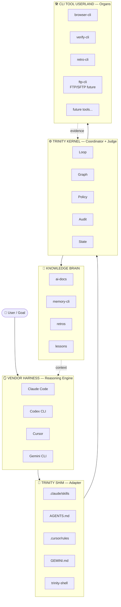

### 1.2 ASCII Version

```text
┌──────────────────────────────────────────────────┐
│ 👤 USER / GOAL                                   │
└──────────────────────┬───────────────────────────┘
                       ▼
┌──────────────────────────────────────────────────┐
│ 🪞 VENDOR HARNESS (Reasoning Engine)             │
│ Claude Code · Codex CLI · Cursor · Gemini · Warp │
└──────────────────────┬───────────────────────────┘
                       ▼
┌──────────────────────────────────────────────────┐
│ 🔌 TRINITY SHIM                                  │
│ • .claude/skills · AGENTS.md · .cursor/rules     │
│ • trinity-shell (universal CLI bridge)           │
└──────────────────────┬───────────────────────────┘
                       ▼
┌──────────────────────────────────────────────────┐
│ ⚙️  TRINITY KERNEL (Coordinator + Judge)         │
│ • Sessions · Loop · Graph · Policy · Audit       │
│ • events.ndjson (hash-chain)                     │
└──────────┬────────────────────────┬──────────────┘
           ▼                        ▼
┌──────────────────────┐  ┌─────────────────────────┐
│ 🧠 KNOWLEDGE BRAIN   │  │ 🛠 CLI TOOL USERLAND   │
│ ai-docs/             │  │ • browser-cli           │
│  ├── retros (240)    │  │ • memory-cli            │
│  ├── lessons (14)    │  │ • verify-cli            │
│  └── workflow ritual │  │ • retro-cli             │
│ memory-cli (search)  │  │ • wordpress-cli (future)│
└──────────────────────┘  │ • ftp-cli (future)      │
                          │ • deploy-cli (future)   │
                          └─────────────────────────┘
```

---

## 2. Iron Triangle — Harness + Loop + Graph

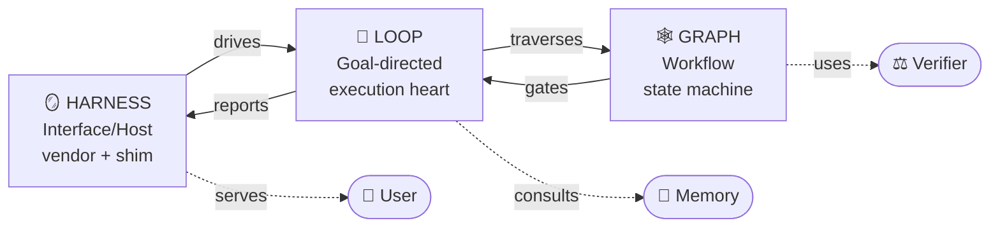

```text
       Harness
       (Interface)
           ↑
           │ user input
           │ user output
           │
           ▼
        ┌──────────────────────┐
        │     LOOP             │
        │  (heart - run cycle) │
        └────┬─────────────────┘
             │
     ┌───────┴────────┐
     │ traverse       │ verify
     ▼                ▼
   ┌──────┐      ┌─────────┐
   │GRAPH │ ←──→ │VERIFIER │
   │      │ gate │ (Judge) │
   └──────┘      └─────────┘
```

---

## 3. Pyramid of Judgment

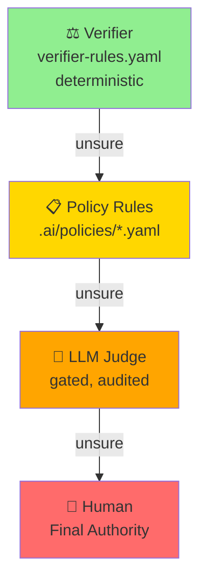

```text
         ┌─────────────┐
         │    Human    │  ← last resort
         └──────▲──────┘
                │ unsure
         ┌──────┴──────┐
         │  LLM Judge  │  ← gated, audited
         │  (gated)    │
         └──────▲──────┘
                │ unsure
         ┌──────┴──────┐
         │   Policy    │  ← .ai/policies/*.yaml
         │   Rules     │
         └──────▲──────┘
                │ unsure
         ┌──────┴──────┐
         │  Verifier   │  ← verifier-rules.yaml
         │ (deterministic)│
         └─────────────┘
```

---

## 4. Standard Workflow Graph

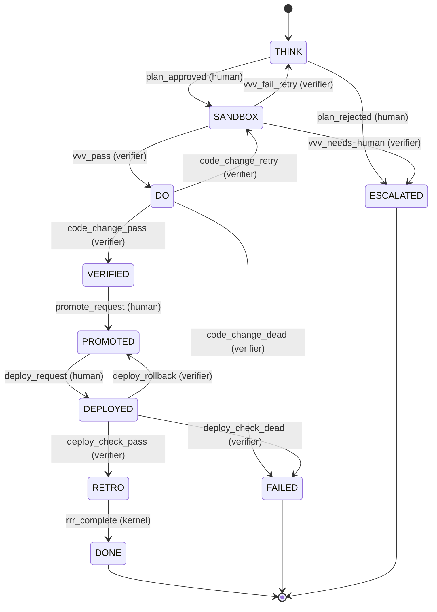

### 4.1 Authority Color Coding

```text
🟢 verifier  → most automated (PASS/RETRY/DEAD)
🟡 policy    → safety/budget enforcement
🔴 human     → sensitive (promote/deploy/destructive)
🔵 kernel    → mechanical (entry/exit, retry)
```

---

## 5. Goal Tree Example

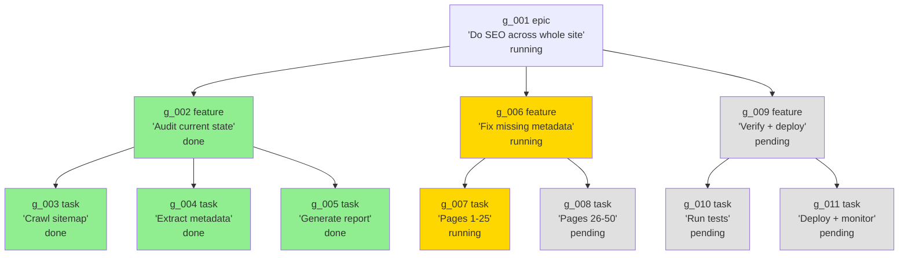

---

## 6. Loop Algorithm Flow

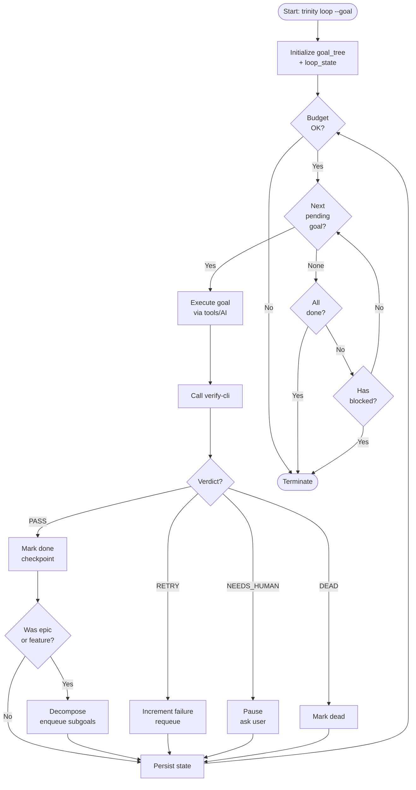

---

## 7. Tool Contract — Common Envelope

```mermaid
graph LR
    subgraph Envelope["Response Envelope (NDJSON line)"]
        OK[ok: bool]
        Cmd[command: string]
        Action[action: 'tool.verb']
        Data[data: object|null]
        Artifacts[artifacts: array]
        Error[error: object|null]
        Meta[meta: object]
    end
    
    Meta --> Tool[tool: string]
    Meta --> SchemaV[schema_version]
    Meta --> RunID[run_id]
    Meta --> Duration[duration_ms]
    Meta --> Timestamp[timestamp]
```

```text
{
  "ok": true,                    ← MUST
  "command": "search",            ← MUST (local verb)
  "action": "memory.search",      ← MUST v1.1+ (canonical)
  "data": { ... },                ← MUST (tool-specific)
  "artifacts": [ ... ],           ← MUST (truth links)
  "error": null,                  ← MUST (null on success)
  "meta": {                       ← MUST
    "tool": "memory-cli@0.1.0",   ← MUST
    "schema_version": "1",        ← MUST
    "run_id": "run_xyz",          ← MUST
    "duration_ms": 42,            ← MUST
    "timestamp": "2026-04-28T..."  ← MUST
  }
}
```

---

## 8. Bootstrap Pack — Install Flow

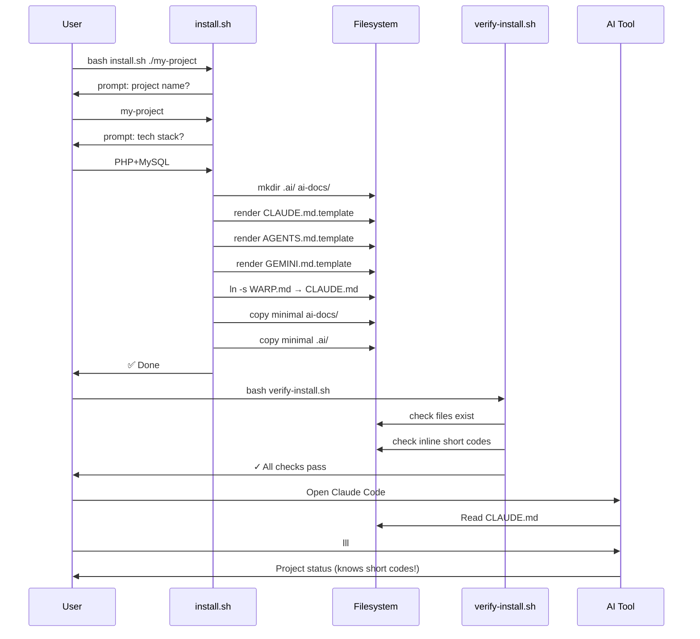

---

## 9. Verify-cli — Verdict Decision Tree

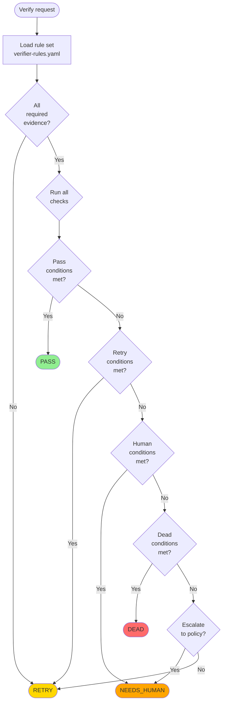

---

## 10. Memory-cli Architecture

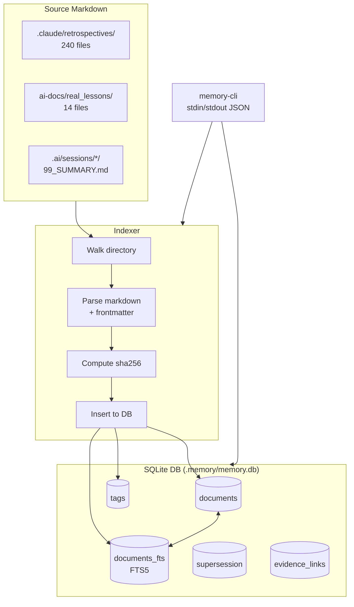

---

## 11. Tool Ecosystem — Vendor + Trinity Tools

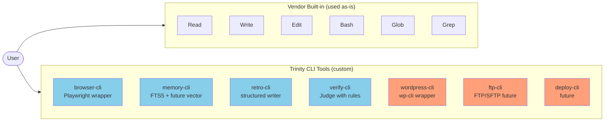

---

## 12. Session Lifecycle (Example Project-style THINK→DEPLOYED)

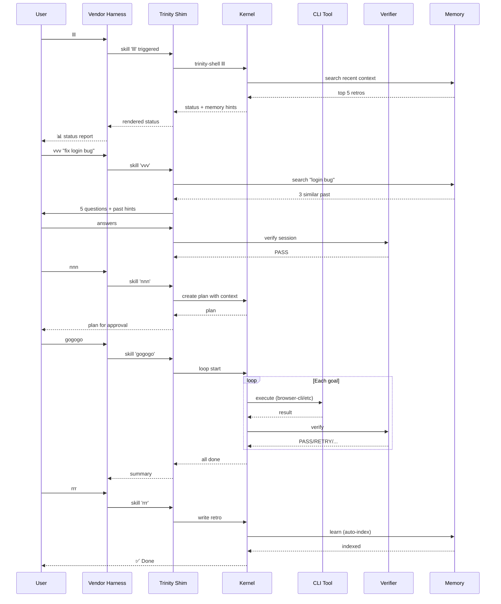

---

## 13. Audit Hash Chain

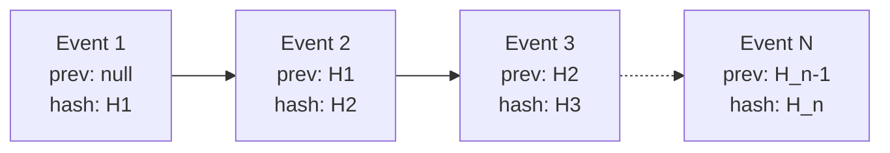

```text
events.ndjson:

{ "ts": "...", "event": "session_start", "prev_hash": null, "hash": "abc..." }
{ "ts": "...", "event": "vvv_pass", "prev_hash": "abc...", "hash": "def..." }
{ "ts": "...", "event": "tool_call", "prev_hash": "def...", "hash": "ghi..." }
{ "ts": "...", "event": "verify_verdict", "prev_hash": "ghi...", "hash": "jkl..." }
...

Tampering detection:
  rebuild hashes → if mismatch = log corrupted
```

---

## 14. Phase Roadmap (10 phases)

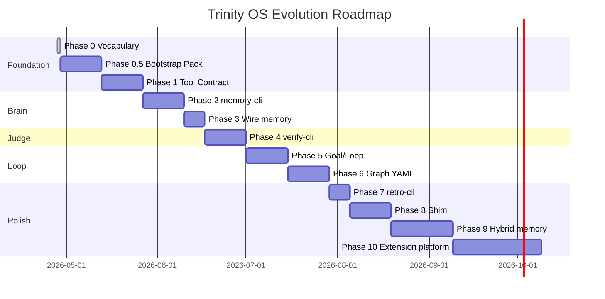

---

## 15. Vendor Adapter Comparison

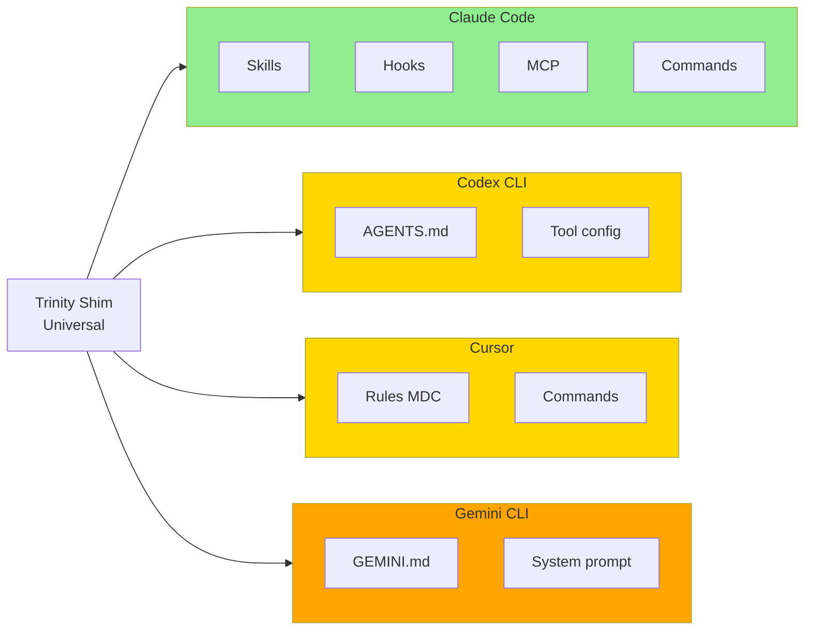

```text
Capability matrix:

                    │ Claude Code │ Codex CLI │ Cursor │ Gemini CLI │
────────────────────┼─────────────┼───────────┼────────┼────────────┤
Slash commands      │     ✅       │    ⚠️      │   ⚠️    │     ❌      │
Pre-response hooks  │     ✅       │    ❌      │   ❌    │     ❌      │
Post-response hooks │     ✅       │    ❌      │   ❌    │     ❌      │
Tool call hooks     │     ✅       │    ⚠️      │   ❌    │     ❌      │
Permission UX       │     ✅       │    ⚠️      │   ⚠️    │     ❌      │
Streaming           │     ✅       │    ✅      │   ✅    │     ✅      │
MCP support         │     ✅       │    ❌      │   ⚠️    │     ❌      │
Custom prompt       │     ✅       │    ✅      │   ✅    │     ✅      │

→ Claude Code = best harness for Trinity shim
```

---

## 16. Data Flow — From Goal to Memory

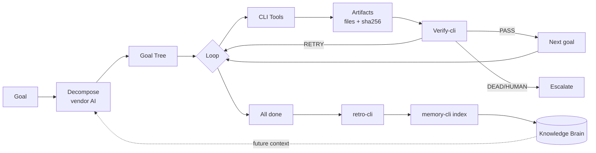

---

## 17. State Persistence — File Layout

```text
.ai/
├── ssot.yaml                          ← project SSOT
├── tools.yaml                         ← tool registry
├── shim-config.yaml                   ← shim adapter config
│
├── policies/
│   ├── safety.yaml                    ← forbidden patterns
│   ├── verifier-rules.yaml            ← Judge rules
│   ├── loop-budget.yaml               ← budget limits
│   └── llm_judge.yaml                 ← when to invoke LLM judge
│
├── graphs/
│   ├── standard.yaml                  ← default workflow
│   ├── deploy.yaml                    ← deployment workflow
│   ├── seo.yaml                       ← SEO workflow
│   └── conditions.yaml                ← shared conditions
│
├── schemas/
│   ├── envelope-v1.schema.json
│   ├── verifier-rules.schema.json
│   ├── goal.schema.json
│   ├── loop_state.schema.json
│   └── retro-frontmatter.schema.json
│
├── audit/
│   ├── events.ndjson                  ← hash-chain log
│   ├── signatures/                    ← cryptographic proofs
│   └── llm-judge/                     ← LLM judge prompts/responses
│
├── sessions/
│   ├── active/                        ← symlink to current
│   └── <session-id>/
│       ├── .id
│       ├── 00_CONTEXT.md
│       ├── 01_PROMPT.md
│       ├── 02_PLAN.md
│       ├── 99_SUMMARY.md
│       ├── goals.yaml                 ← goal tree
│       ├── loop_state.json            ← runtime state
│       ├── checkpoints/
│       └── DO/
│           ├── snapshot/              ← read-only
│           ├── dev/                   ← work here
│           └── prod/                  ← after promote
│
└── cli/
    └── (Python kernel commands)
```

---

## 18. Composability Example — Pipe + Chain

```text
User wants: "Find auth bug, fix it, deploy with backup"

Step 1: Search memory
  trinity-shell consult "auth bug" --json | jq '.data.results'

Step 2: Get specific past retro
  memory-cli get r_2025-11-25_auth-fix --json

Step 3: Open browser for manual repro
  browser-cli --cmd "goto /backend/login ; screenshot ; eval 'document.title'"

Step 4: Run verify before fix
  verify-cli --cmd "verify --rule-set=code_change"

Step 5: Apply fix in dev
  (vendor AI uses Edit tool to modify code)

Step 6: Verify code change
  verify-cli --cmd "verify --rule-set=code_change"

Step 7: Promote to prod
  trinity loop transition promote_request --human-approval=YES

Step 8: Backup before deploy
  deploy-cli --cmd "backup ; deploy --env=prod"

Step 9: Verify deployment
  verify-cli --cmd "verify --rule-set=deploy_check"

Step 10: Write retro + index
  retro-cli --cmd "create --session=$SESSION_ID"
  retro-cli --cmd "commit RETRO.md"   # auto memory-cli index
```

---

## 19. Quick Visual Cheat Sheet

```text
🪞 Harness    = Vendor (Claude Code / Codex / Cursor / Gemini)
🔌 Shim       = trinity-shell + adapters (.claude/skills, AGENTS.md, ...)
⚙️  Kernel     = Trinity (sessions, locks, audit, policy)
🧠 Brain      = ai-docs + memory-cli (FTS5)
🛠 Organs     = browser-cli, verify-cli, retro-cli, ftp-cli, ...
⚖️  Judge      = verify-cli + verifier-rules.yaml
📜 Truth      = artifacts + events.ndjson (hash-chain)
🌀 Loop       = goal tree + checkpoint/resume
🕸 Graph      = workflow.yaml + transition authority
```

---

## 20. Mind Model (One Picture)

```text
                    ┌─────────────┐
                    │   👤 USER   │
                    └──────┬──────┘
                           │ goals
                           ▼
                ┌──────────────────────┐
                │   🪞 VENDOR HARNESS  │  ← reasoning + LLM
                │   (Claude/Codex/...)  │
                └──────────┬───────────┘
                           │ slash commands
                           ▼
                ┌──────────────────────┐
                │   🔌 TRINITY SHIM     │  ← bridge
                └──────────┬───────────┘
                           │ shells out
                           ▼
                ┌──────────────────────┐
                │   ⚙️  TRINITY KERNEL │  ← coordinator + judge
                │  • loop              │
                │  • graph             │
                │  • verify            │
                │  • policy            │
                │  • audit             │
                └────┬───────────┬─────┘
                     │           │
                     ▼           ▼
              ┌──────────┐  ┌─────────────┐
              │🧠 BRAIN  │  │ 🛠 ORGANS   │
              │ai-docs   │  │ browser-cli │
              │memory-cli│  │ memory-cli  │
              │retros    │  │ verify-cli  │
              │lessons   │  │ retro-cli   │
              │          │  │ ftp-cli     │
              └──────────┘  └─────────────┘
                     │           │
                     └─────┬─────┘
                           ▼
                  ┌────────────────┐
                  │ 📜 ARTIFACTS    │  ← truth
                  │ events.ndjson  │     (hash-chain)
                  └────────────────┘
```

---

## See also

- [`00_BLUEPRINT.md`](00_BLUEPRINT.md) — Master spec
- All other specs (each has its own diagrams inline)

## Changelog

- **v1.0.0 (2026-04-28)** — Initial diagrams collection
