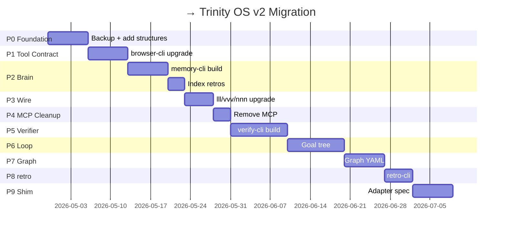

# <upstream-project> — Trinity OS Migration Audit (English)

> **Audit of <upstream-project> vs Trinity OS v2 spec — gap analysis + migration plan.**
>
> <upstream-project> = production project running 6+ months · do not break · migrate additively.

---

## 0. Status

- **Audit date:** 2026-04-28
- **Project:** `<workspace-root>/<upstream-project>/`
- **Reference:** Trinity OS v2 (Phases 0-10)
- **Verdict:** **80% compliant** — strong foundation, gaps in Brain layer + Tool Contract

---

## 1. Executive Summary

### Strengths (<upstream-project> already has)

```text
✅ Trinity Kernel (Python CLI) — production-tested
✅ 3 Locks (SSOT/Gates/Audit) — committed events.ndjson hash chain
✅ ai-docs methodology — evolved past v3 (commands + protocols + contracts)
✅ 240 retrospectives + 14 real_lessons — Knowledge Brain raw data ready
✅ Sessions THINK/SANDBOX/DO/CONTROL — workflow capsules working
✅ Multiple AI tool integration — Claude/Codex/Gemini/Cursor configured
✅ enforce.sh — basic runtime safety
```

### Critical Gaps

```text
❌ memory-cli — missing → 240 retros only searchable via grep
❌ retro-cli — missing → retros free-form, no schema
❌ verify-cli + verifier-rules.yaml — has vvv command but no deterministic rules
❌ Tool Contract compliance — browser-cli uses similar pattern but not official
❌ Goal Tree + Loop State — workflow still manual sequence
❌ Graph YAML + transition authority — has graph but implicit
❌ Trinity Shim adapter — has skills but not per spec
⚠️  MCP servers (Playwright/Morphllm/Sequential) — must remove (decision #5)
```

### Migration Risk

```text
🟢 LOW: Add new structures (additive — memory-cli, verify-cli, retro-cli)
🟡 MED: Update CLAUDE.md/AGENTS.md (manual merge)
🔴 HIGH: Remove MCP (need browser-cli to fully replace Playwright MCP)
🔴 HIGH: Modify .ai/cli/ kernel (breaks existing workflow if wrong)
```

---

## 2. Component-by-Component Audit

### 2.1 Trinity Kernel (`<upstream-project>/.ai/`)

#### Current State

```
<upstream-project>/.ai/
├── cli/                          ← Python Typer CLI ✅
│   ├── main.py
│   └── commands/                 ← session, verify, sandbox, promote, ...
├── ssot.yaml                     ← ✅ Single Source of Truth
├── policies/
│   ├── safety.yaml               ← ✅ exists
│   ├── gates.yaml                ← ✅ exists
│   ├── rbac.yaml                 ← ✅ exists
│   └── (verifier-rules.yaml)     ← ❌ MISSING
├── schemas/                      ← ✅ 5 JSON Schemas
├── state/                        ← ✅ status, locks, verify_report
├── sessions/                     ← ✅ THINK/SANDBOX/DO
├── memory/                       ← ⚠️ markdown only (no FTS5)
└── audit/events.ndjson           ← ✅ hash chain
```

#### vs Trinity OS v2 Spec

| Component | <upstream-project> | Trinity OS v2 | Gap |
|-----------|--------|---------------|-----|
| `cli/main.py` (kernel) | ✅ | ✅ | None |
| `ssot.yaml` | ✅ | ✅ | None |
| `policies/safety.yaml` | ✅ | ✅ | None |
| `policies/gates.yaml` | ✅ | ✅ | None |
| `policies/rbac.yaml` | ✅ | ✅ | None |
| `policies/verifier-rules.yaml` | ❌ | ✅ MUST | **Add** |
| `policies/loop-budget.yaml` | ❌ | ✅ | **Add** |
| `schemas/` (JSON Schema) | ✅ 5 | ✅ | Compatible |
| `graphs/` (workflow YAML) | ❌ | ✅ MUST | **Add** |
| `tools.yaml` (registry) | ❌ | ✅ MUST | **Add** |
| `sessions/` capsules | ✅ | ✅ | Compatible |
| `audit/events.ndjson` | ✅ | ✅ | None |
| `memory/` markdown index | ⚠️ | ⚠️ → SQLite FTS5 | **Migrate** |

#### Action Items

- [ ] Add `policies/verifier-rules.yaml` (Phase 4)
- [ ] Add `policies/loop-budget.yaml` (Phase 5)
- [ ] Add `graphs/standard.yaml` (Phase 6)
- [ ] Add `graphs/deploy.yaml` (Phase 6)
- [ ] Add `tools.yaml` (Phase 1)
- [ ] Plan memory migration: markdown → memory-cli SQLite (Phase 2-3)

---

### 2.2 ai-docs Methodology (`<upstream-project>/ai-docs/`)

#### Current State

```
<upstream-project>/ai-docs/
├── 01-CORE_PROTOCOL/             ← ✅ excellent (workflow, safety, multi-AI)
├── 02-STANDARDS/                 ← ✅ universal rules, env vars
├── 03-PROCESS/                   ← ✅ rollback, etc.
├── 04-MEMORY/                    ← ⚠️ structure exists but mostly empty
├── commands/                     ← ✅ LLL/VVV/NNN/GOGOGO/RRR specs
├── protocols/                    ← ✅ *_CONTRACT.md (machine-readable!)
├── prevention/                   ← ✅ anti-patterns + best practices
├── real_lessons/                 ← ✅ 14 incidents
├── templates/                    ← ✅ retro/plan templates
└── init.sh                       ← ⚠️ project init (different from Trinity install)
```

#### vs Trinity OS v2 Spec

| Aspect | <upstream-project> | v2 Spec | Gap |
|--------|--------|---------|-----|
| Workflow methodology | ✅ excellent | ✅ | None — <upstream-project> ahead |
| Command specs | ✅ commands/*.md | (Bootstrap Pack uses) | Compatible |
| Contract specs | ✅ protocols/*_CONTRACT.md | (Trinity uses) | Compatible |
| real_lessons | ✅ 14 files | ✅ index by memory-cli | **Index** |
| templates | ✅ 15 files | ✅ | Compatible |
| Knowledge Brain status | Soft (markdown) | Hard (FTS5) | **Migrate** |

#### Verdict

> ✅ **<upstream-project>/ai-docs is better than the Bootstrap Pack baseline** — keep as-is, just **index into memory-cli**.

#### Action Items

- [ ] Index `ai-docs/real_lessons/` into memory-cli (`confidence=verified`)
- [ ] Add frontmatter to legacy real_lessons (retro-cli migrate)
- [ ] Reference <upstream-project>'s command/protocol specs from Trinity Bootstrap Pack (cross-link)

---

### 2.3 .claude/ Configuration

#### Current State

```
<upstream-project>/.claude/
├── settings.local.json           ← ⚠️ 104 perms incl MCP (must clean)
├── retrospectives/               ← ✅ 240 files (6 months)
├── skills/                       ← ⚠️ exists but not Trinity-spec
├── plans/, implementations/, context/
└── (multiple SHORT_CODES.md, COMMANDS_REFERENCE.md, etc.)
```

#### Action Items

- [ ] **Remove MCP perms** from settings.local.json (decision #5):
  - `mcp__playwright__*` (13 entries)
  - `mcp__morphllm-fast-apply__*` (8 entries)
  - `mcp__sequential-thinking__*` (1 entry)
  - **Keep:** `mcp__ide__executeCode` (vendor IDE bridge)
- [ ] **Index 240 retrospectives** into memory-cli
- [ ] **Update skills/** to Trinity Shim spec (Phase 8)
- [ ] **Consolidate SHORT_CODES.md** into single Trinity-spec source

---

### 2.4 CLAUDE.md (root)

#### Current State

- **Size:** 21KB (large!)
- **Content:** mandatory blockers, response checklist, short codes, file navigation, safety rules

#### vs Trinity OS v2 Spec (Bootstrap Pack template)

| Section | <upstream-project> CLAUDE.md | Bootstrap Template |
|---------|-----------------|-------------------|
| READ FIRST blockers | ✅ | ✅ |
| Inline short codes | ✅ (linked, not inline) | ✅ inline (better) |
| Quick start | ✅ | ✅ |
| Project info | ✅ | ✅ |
| Safety rules | ✅ | ✅ |
| Tools list | ⚠️ implicit | ✅ explicit |
| Trinity vocabulary | ❌ | ✅ |
| Memory layer link | ❌ | ✅ |

#### Action Items

- [ ] Inline short codes definitions (currently linked-only)
- [ ] Add Trinity vocabulary cheat sheet section
- [ ] Add explicit tools list (link to `.ai/tools.yaml`)
- [ ] Add Knowledge Brain section (memory-cli search example)
- [ ] **Reduce size** — extract project-specific to `.ai/project-info.md`

---

### 2.5 AGENTS.md (root)

#### Current State

- **Size:** 11KB
- **Quality:** ⭐ Inline short codes at lines 46-52 (good!)
- **Pattern:** vendor-aware (Codex/Gemini/Claude task assignment matrix)

#### vs Trinity OS v2 Spec

✅ **<upstream-project> AGENTS.md is reference-quality** — use as template for Bootstrap Pack.

#### Action Items

- [ ] Add Trinity vocabulary section (Knowledge Brain / Reasoning Engine / etc.)
- [ ] Reference `.ai/tools.yaml` for tool discovery
- [ ] Update for v2 (remove MCP references)

---

### 2.6 GEMINI.md

#### Current State

❌ **MISSING** — <upstream-project> has no GEMINI.md at root.

#### Action Items

- [ ] Create from Bootstrap Pack template

---

### 2.7 browser-cli (external `<workspace-root>/browser-cli/`)

#### Current State

- **Pattern:** ✅ stdin/stdout JSON, schema-locked v1/v2, NDJSON log, policy tiers, helpers YAML
- **Used by:** <upstream-project> (configs/<upstream-project>.json + configs/<upstream-project>-prod.json)

#### vs Trinity OS v2 Spec (Tool Contract)

| Contract Item | browser-cli | v1.1 Spec |
|---------------|-------------|-----------|
| stdin/stdout JSON | ✅ | ✅ |
| 4 exec modes | ✅ (single-cmd, REPL, pipe, run-file) | ✅ |
| Universal flags | ⚠️ partial | Need: `--run-id` confirm, `--list-commands`, `--describe`, `--health` |
| Response envelope | ⚠️ v1/v2 mostly compliant | Need: `action` field (v1.1), unified `meta` |
| Policy tiers | ✅ | ✅ |
| NDJSON logging | ✅ | ✅ |
| Helpers YAML | ✅ | ✅ |
| Tool registry entry | ❌ | Need: `.ai/tools.yaml` |
| Contract test | ❌ | Need: `trinity-contract-test browser-cli` (Phase 1) |
| Capability gap (vs Playwright MCP) | ⚠️ check `tabs`, `handle-dialog` | Add if missing |

#### Action Items

- [ ] Verify browser-cli has `tabs` command (multi-tab)
- [ ] Verify browser-cli has `handle-dialog` (alert/confirm)
- [ ] Upgrade response envelope to v1.1 (add `action` field)
- [ ] Add `--list-commands`, `--describe`, `--health` flags
- [ ] Run `trinity-contract-test browser-cli` (when available)
- [ ] Register in `.ai/tools.yaml`

---

### 2.8 MCP Servers (External)

#### Current State

| MCP | Tools | Status | Action |
|-----|-------|--------|--------|
| `mcp__playwright__` | 13 | 🔴 Remove (replace with browser-cli) | Phase 1 |
| `mcp__morphllm-fast-apply__` | 8 | 🔴 Remove (use vendor Read/Write/Edit) | Phase 1 |
| `mcp__sequential-thinking__` | 1 | 🔴 Remove (use ai-docs workflow) | Phase 1 |
| `mcp__ide__executeCode` | 1 | ✅ Keep (vendor IDE bridge) | - |

#### Action Items

- [ ] Verify browser-cli capability covers Playwright MCP 13 tools
- [ ] Test workflow without Morphllm (use built-in Read/Write/Edit)
- [ ] Remove from `.claude/settings.local.json`
- [ ] Remove from `~/.claude.json` (user-level MCP config)
- [ ] Audit any references in CLAUDE.md/AGENTS.md/docs

---

## 3. Priority Migration Plan

### 🔴 P0 — Foundation (Week 1-2)

```text
Goal: Don't break <upstream-project>, set up new structures additively

1. Create TRINITY_EVOLUTION/ in <upstream-project>
   (already done — link to specs)

2. Add missing kernel files (additive):
   - .ai/policies/verifier-rules.yaml (template only)
   - .ai/graphs/standard.yaml (template only)
   - .ai/tools.yaml (empty registry)

3. Backup before any modification
   - git branch backup/pre-trinity-v2
   - tag pre-trinity-v2
   - Copy .claude/, .ai/, ai-docs/, CLAUDE.md, AGENTS.md
```

**Deliverable:** <upstream-project> has new files, old workflow unchanged.

---

### 🔴 P1 — Tool Contract (Week 3-4)

```text
Goal: browser-cli compliant with Tool Contract v1.1

1. browser-cli upgrades:
   - Add `action` field to envelope (v1.1)
   - Add --list-commands, --describe, --health flags
   - Verify `tabs` and `handle-dialog` commands exist
   - Register in <upstream-project>/.ai/tools.yaml

2. Run contract compliance test:
   - trinity-contract-test browser-cli
   - Hit Bronze level minimum

3. Update browser-cli docs to reflect v1.1
```

**Deliverable:** browser-cli is the reference implementation per spec.

---

### 🟡 P2 — Knowledge Brain Activation (Week 5-6)

```text
Goal: Index 240 retros + 14 lessons → searchable

1. Build memory-cli v0.1
   - Clone browser-cli pattern
   - SQLite FTS5
   - Commands: index/search/get/list/stats

2. Index existing data:
   memory-cli --cmd "index .claude/retrospectives/"
   memory-cli --cmd "index ai-docs/real_lessons/ --confidence=verified"
   memory-cli --cmd "stats"

3. Verify:
   memory-cli --cmd "search 'auth bug'"
   → returns relevant past retros

4. Register in .ai/tools.yaml
```

**Deliverable:** <upstream-project> brain searchable via CLI.

---

### 🟡 P3 — Wire Brain into Workflow (Week 7)

```text
Goal: lll/vvv/nnn pull from memory-cli

1. Update Trinity kernel commands:
   - lll → also call memory-cli for recent + relevant
   - vvv → search past similar incidents before 5 questions
   - nnn → inject memory hints to plan

2. Test on real task:
   - Run vvv "fix auth bug"
   - Verify it finds past r_2025-11-25_username-display-fix

3. Document new behavior
```

**Deliverable:** AI starts every session with relevant context.

---

### 🟡 P4 — MCP Cleanup (Week 8)

```text
Goal: Remove external MCP servers (decision #5)

1. Test workflow WITHOUT MCP:
   - Browser ops via browser-cli
   - File ops via vendor built-in
   - Reasoning via ai-docs ritual

2. If all works:
   - Remove MCP perms from .claude/settings.local.json
   - Remove MCP server config from ~/.claude.json
   - Update CLAUDE.md/AGENTS.md to remove MCP refs

3. Validate:
   - Open Claude Code → no MCP server errors
   - Run sample tasks → all work
```

**Deliverable:** <upstream-project> is 100% CLI-first (no MCP dependency).

---

### 🟢 P5 — Verifier Layer (Week 9-10)

```text
Goal: Judge with file-based rules

1. Build verify-cli (Phase 4)
2. Author .ai/policies/verifier-rules.yaml:
   - default rule
   - code_change rule (specific to <upstream-project> PHP+Smarty)
   - browser_check rule
   - deploy_check rule (<upstream-project> FTPS)
   - memory_promote rule

3. Wire into existing vvv command (<upstream-project> already has)
   - <upstream-project>'s vvv → call verify-cli
   - existing logic preserved

4. Register in .ai/tools.yaml
```

**Deliverable:** <upstream-project> verdicts deterministic (PASS/RETRY/NEEDS_HUMAN/DEAD).

---

### 🟢 P6 — Goal Tree + Loop State (Week 11-12)

```text
Goal: Trinity loop runs until done (not just one-shot)

1. Add goal schema to .ai/sessions/<id>/goals.yaml
2. Add loop_state.json
3. Update kernel CLI:
   - trinity loop start --goal "..."
   - trinity loop status
   - trinity loop resume

4. Test on multi-step task:
   - "Audit + fix SEO 50 pages"
   - Verify decomposition + sub-goal tracking
```

**Deliverable:** <upstream-project> can run multi-hour goals semi-auto.

---

### 🟢 P7 — Graph YAML (Week 13-14)

```text
Goal: Workflow with explicit transition authority

1. Convert <upstream-project>'s implicit graph (THINK→SANDBOX→DO→PROMOTED→DEPLOYED)
   to .ai/graphs/standard.yaml

2. Add transition `decided_by`:
   - vvv_pass: verifier
   - promote_request: human
   - deploy_request: human
   - rollback: verifier

3. Validate with trinity graph validate
4. Audit: every transition logged with decided_by
```

**Deliverable:** <upstream-project> workflow declarative + audited.

---

### 🟢 P8 — retro-cli + auto memory (Week 15)

```text
Goal: rrr → structured retro → auto-index

1. Build retro-cli (Phase 7)
2. Add frontmatter schema (additive)
3. Auto-call memory-cli index after rrr commit
4. Migrate legacy 240 retros (add frontmatter)

   find .claude/retrospectives -name "*.md" \
     | xargs -I {} retro-cli --cmd "migrate {}"
```

**Deliverable:** rrr produces high-quality memory.

---

### 🟢 P9 — Trinity Shim (Week 16-17)

```text
Goal: Vendor harness adapters per Trinity spec

1. Update .claude/skills/ to Trinity Shim spec (Phase 8)
2. Add hooks for audit log
3. Update AGENTS.md/GEMINI.md to call trinity-shell
4. Test with all 4 vendor harnesses
```

**Deliverable:** Vendor-agnostic Trinity workflow.

---

### 🟢 P10+ — Polish (Week 18+)

- Hybrid memory (vector — Phase 9)
- Extension platform (Phase 10)
- Dashboard (Phase 10)

---

## 4. Risk Matrix

| Risk | Likelihood | Impact | Mitigation |
|------|-----------|--------|------------|
| Breaking <upstream-project> production workflow | Medium | High | Additive changes only · backup branch · test before merge |
| MCP removal blocks browser ops | Medium | High | Verify browser-cli covers all Playwright MCP 13 tools first |
| 240 retros indexing fails | Low | Medium | Validate sample first · skip + log errors |
| Verifier too strict (workflow stuck) | Medium | Medium | Start permissive · tune over time |
| Goal tree decomposition wrong | Medium | Low | Manual override · checkpoint frequently |
| Audit chain corrupted during migration | Low | High | Read-only during migration · backup first |
| Multi-tool integration breaks | Medium | Medium | Test each phase independently |
| Team confusion (new vocabulary) | High | Low | Document migration · keep old terms in retros |

---

## 5. What NOT to Migrate

### Keep As-is (no change)

| Thing | Why |
|-------|-----|
| `<upstream-project>/.ai/cli/` Python implementation | Working production code |
| `<upstream-project>/ai-docs/01-04` folder structure | Better than Bootstrap baseline |
| `<upstream-project>/ai-docs/commands/*.md` | Already excellent |
| `<upstream-project>/ai-docs/protocols/*_CONTRACT.md` | Reference for v2 |
| `<upstream-project>/.claude/retrospectives/` | Source data |
| `<upstream-project>/scripts/` (deploy, enforce, gen_index) | Working |
| `<upstream-project>/16-02-69/` | Project legacy data |

### Won't Migrate (decision)

| Thing | Why |
|-------|-----|
| MCP servers (external) | Decision #5 — CLI-first only |
| GitHub issue auto-flow | Out of scope |
| Multi-AI ritual specifics | Project preference, not core |
| Auto PR | Out of scope (human approval) |

---

## 6. Backward Compatibility Strategy

### 6.1 Coexistence (during migration)

```text
Phase 0-2: Both old + new structures coexist
- Old workflow continues to work
- New tools (memory-cli, verify-cli) added
- Old vvv command still works (just enhanced)

Phase 3-5: New tools become primary
- lll/vvv/nnn pulls from memory-cli (transparent)
- Old behavior preserved as fallback

Phase 6+: Full v2
- Old structures still readable
- All new sessions use v2 conventions
```

### 6.2 Compatibility Checklist

- [ ] Old retros still searchable (memory-cli imports them)
- [ ] Old sessions still readable
- [ ] Old `vvv` command still works (with enhancements)
- [ ] Existing CLAUDE.md mandatory rules preserved
- [ ] Existing safety policies enforced
- [ ] events.ndjson chain continues (no break)

---

## 7. Validation Tests

### After each phase, run:

```bash
# Smoke test — workflow still works
trinity loop start --goal "test task" --dry-run

# Tool health
for tool in browser-cli memory-cli verify-cli; do
  trinity tool health $tool
done

# Audit chain integrity
trinity audit verify-chain

# Memory consistency
memory-cli --cmd "stats"
sqlite3 .memory/memory.db "PRAGMA integrity_check"

# Old workflow regression
# (run typical <upstream-project> task end-to-end)
```

---

## 8. Communication Plan (for team)

### 8.1 Vocabulary Update

Before:
```
"Our AI" / "Trinity system" (vague)
```

After:
```
ai-docs = Knowledge Brain
Trinity = Coordinator + Judge
CLI tools = Organs
Vendor AI = Reasoning Engine
Verifier = Judge
Artifacts = Truth
```

### 8.2 Workflow Update

Before:
```
Manual: lll → vvv → nnn → gogogo → rrr
```

After (v2):
```
Same commands, more powerful:
- lll auto-pulls memory context
- vvv auto-searches past incidents
- nnn auto-injects hints
- gogogo loops with goal tree
- rrr auto-indexes (memory updates)
```

### 8.3 Documentation Update

```text
- Update <upstream-project>/CLAUDE.md (manual merge from Bootstrap)
- Add <upstream-project>/GEMINI.md (new from Bootstrap)
- Update .claude/skills/ for Trinity Shim
- Cross-link to TRINITY_EVOLUTION/ specs
```

---

## 9. Specific Action Checklist (Quick Wins)

### Today (1-2 hours)

- [x] Create `<upstream-project>/TRINITY_EVOLUTION/` symlink to specs
- [ ] Add backup branch: `git branch backup/pre-trinity-v2`
- [ ] Tag: `git tag pre-trinity-v2`
- [ ] Backup `.claude/settings.local.json`
- [ ] Document current MCP usage (audit complete in this doc)

### This Week (P0 — Additive)

- [ ] Create `.ai/policies/verifier-rules.yaml` (template)
- [ ] Create `.ai/graphs/standard.yaml` (template)
- [ ] Create `.ai/tools.yaml` (empty registry)
- [ ] Add `GEMINI.md` (from Bootstrap template)
- [ ] Test: old workflow unchanged

### Next Week (P1 — browser-cli compliance)

- [ ] Audit browser-cli command coverage vs Playwright MCP
- [ ] Add `--list-commands`, `--describe`, `--health` flags
- [ ] Add `action` field to envelope
- [ ] Update `tools.yaml` with browser-cli entry

### Month 1 (P2-P4)

- [ ] Build memory-cli v0.1
- [ ] Index 240 retros + 14 lessons
- [ ] Wire memory into lll/vvv/nnn
- [ ] Remove MCP servers (final)

---

## 10. Success Metrics

After full migration, measure:

| Metric | Baseline (v1) | Target (v2) |
|--------|---------------|-------------|
| Time to context (new session) | ~5 min | ~30 sec (memory recall auto) |
| Past incident discovery rate | 30% (grep manual) | 90%+ (semantic search) |
| First-time fix rate | ~85% | 95%+ |
| MCP server dependencies | 4 | 0 |
| Tool contract compliance | N/A | 100% (Bronze+ all tools) |
| Audit chain integrity | 100% | 100% (no regression) |
| Workflow break rate | <5% | <5% (no regression) |
| Goal completion auto-resume rate | 0% (manual) | 80%+ (after Phase 5) |

---

## 11. Open Questions for Team

1. browser-cli capability — does it cover all Playwright MCP 13 tools?
2. memory-cli — Node or Python (for consistency with the Python kernel)?
3. retros 240 — some are low-quality drafts — what to do?
4. <upstream-project> production timing — when's the migration window?
5. Multi-project — <upstream-project> + new projects share tools dir?
6. memory-cli location — `~/.memory/` per project or central?
7. MCP removal — all at once or one at a time?
8. Skills update — break existing Claude Code session?

---

## 12. Migration Schedule



---

## 13. Quick Reference

### Files to Create (Additive)

```text
.ai/policies/verifier-rules.yaml    ← P5
.ai/policies/loop-budget.yaml       ← P6
.ai/graphs/standard.yaml            ← P7
.ai/graphs/deploy.yaml              ← P7
.ai/tools.yaml                      ← P1
GEMINI.md                           ← P0
TRINITY_EVOLUTION/                  ← (already done)
```

### Files to Update (Manual Merge)

```text
CLAUDE.md                           ← P0 (add v2 vocabulary)
AGENTS.md                           ← P0 (remove MCP refs)
.claude/settings.local.json         ← P4 (remove MCP perms)
.claude/skills/*                    ← P9 (Trinity Shim spec)
```

### Files to Build (New Tools)

```text
~/code/memory-cli/                  ← P2
~/code/verify-cli/                  ← P5
~/code/retro-cli/                   ← P8
~/code/trinity-shell/               ← P9
```

### Files to Migrate (Not Remove)

```text
.claude/retrospectives/             ← Index into memory-cli (keep)
ai-docs/real_lessons/               ← Index (keep)
.ai/sessions/                       ← Continue using (keep)
```

### Files to Remove

```text
~/.claude.json :: MCP server config (Playwright/Morphllm/Sequential) ← P4
.claude/settings.local.json :: MCP perms ← P4
```

---

## 14. Risks & Mitigations Summary

```text
🔴 HIGH Risk
- MCP removal breaks browser ops
  → Mitigation: ensure browser-cli capability complete first
- Audit chain corrupted during migration
  → Mitigation: read-only during migration + backup

🟡 MED Risk  
- Verifier rules too strict
  → Mitigation: start permissive, tune iteratively
- Team confusion with new vocabulary
  → Mitigation: cheat sheet + gradual adoption

🟢 LOW Risk
- Index errors on bad retros
  → Mitigation: skip + log, don't fail entire batch
```

---

## 15. Final Recommendation

> **Start with P0 (additive backup + structures) immediately.**
>
> **Don't touch the production workflow until P4 is complete (MCP cleanup).**
>
> **Phase 2 (memory-cli + index 240 retros) = highest ROI** — unlocks semantic recall right away.
>
> **Don't rush — 17-week timeline is realistic, not 4 weeks.**

---

## See also

- [`00_BLUEPRINT.md`](00_BLUEPRINT.md) — Master spec
- [`00b_BOOTSTRAP_PACK.md`](00b_BOOTSTRAP_PACK.md) — Source of templates
- [`09_DEPLOY_GUIDE.md`](09_DEPLOY_GUIDE.md) — Operational procedures

## Changelog

- **v1.0.0 (2026-04-28)** — Initial audit + migration plan
